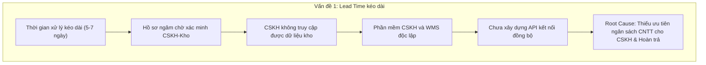
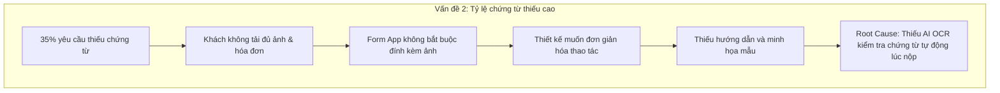
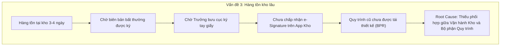

# 3.8 Quản lý hoàn trả hàng & Chăm sóc khách hàng (CSKH) - Viettel Post

## 3.8.3 PHÂN TÍCH ĐỊNH TÍNH (QUALITATIVE ANALYSIS)

Tài liệu tham chiếu chuẩn giảng dạy: **Chương 5 - Phân tích quy trình (Process Analysis)** - ThS. Hà Lê Hoài Trung (UIT).

---

### 3.8.3.1 Phân tích giá trị gia tăng (Value-added Analysis)

#### a. Nguyên lý & Tiêu chí phân loại
Phân tích giá trị gia tăng (Value-Added Analysis) rã nhỏ quy trình nghiệp vụ thành các bước hoạt động và đánh giá mức độ đóng góp giá trị cho khách hàng và doanh nghiệp. Các bước được phân thành 3 nhóm:

1. **Value-Adding (VA) - Hoạt động gia tăng giá trị**:
   - **Định nghĩa**: Trực tiếp làm thay đổi trạng thái sản phẩm/dịch vụ nhằm thỏa mãn nhu cầu chính đáng của khách hàng, tạo giá trị mà khách hàng nhận thức được và sẵn sàng chi trả.
   - **Checklist đánh giá**:
     - Khách hàng có sẵn sàng trả tiền cho bước này không?
     - Khách hàng có đồng ý rằng bước này là bắt buộc để đạt được mục tiêu của họ không?
     - Nếu bỏ bước này, khách hàng có nhận thấy dịch vụ cuối cùng ít giá trị hơn không?

2. **Business Value-Adding (BVA) - Hoạt động gia tăng giá trị doanh nghiệp**:
   - **Định nghĩa**: Không trực tiếp tạo giá trị cho khách hàng nhưng cần thiết để doanh nghiệp vận hành, kiểm soát rủi ro tài chính, quản lý hệ thống hoặc tuân thủ quy định pháp luật / quy chuẩn nội bộ Viettel Post.
   - **Checklist đánh giá**:
     - Bước này có cần thiết để tạo doanh thu, kiểm soát thất thoát hoặc tuân thủ quy định không?
     - Loại bỏ bước này có làm doanh nghiệp bị ảnh hưởng tiêu cực trong dài hạn không?

3. **Non-Value-Adding (NVA) - Hoạt động không gia tăng giá trị (Lãng phí)**:
   - **Định nghĩa**: Bao gồm tất cả các bước dư thừa, thời gian nằm chờ, di chuyển lặp lại, bàn giao chuyển tiếp qua lại, hoặc làm lại/sửa lỗi do sai sót thông tin ở các bước trước.

---

#### b. Biểu diễn trên mô hình BPMN
Trên sơ đồ quy trình BPMN (`QuyTrinhHoanTraCSKH.bpmn`), các nút công việc được đánh dấu phân loại và mã màu trực quan:
- **[VA] (Xanh lá)**: Gửi yêu cầu hoàn trả, Liên hệ & Thu hồi hàng hóa, Hoàn trả hàng cho người gửi, Giải quyết khiếu nại, Tư vấn khách hàng, Nhận kết quả phản hồi.
- **[BVA] (Xanh dương)**: Tiếp nhận yêu cầu, Kiểm tra thông tin đơn hàng, Xác minh nguyên nhân, Phân loại nhóm yêu cầu, Tiếp nhận lệnh thu hồi, Kiểm tra tình trạng hàng tại kho, Lập biên bản bất thường, Cập nhật kết quả kiểm hàng, Thông báo kết quả phản hồi, Cập nhật hệ thống & lưu trữ.
- **[NVA] (Màu đỏ/cam)**: Cung cấp chứng từ bổ sung (bước làm lại do thiếu thông tin ban đầu), Vận chuyển lặp lại.

---

#### c. Bảng tổng hợp phân loại giá trị gia tăng (Value-Added Analysis Table)

| Step (Bước quy trình) | Performer (Người thực hiện) | Classification | Explanation (Giải thích lý do phân loại) |
|---|---|:---:|---|
| **1. Gửi yêu cầu hoàn trả / khiếu nại** | Khách hàng | **VA** | Khách hàng khởi tạo nhu cầu chính đáng nhằm đổi/trả hàng hoặc phản ánh sự cố dịch vụ để được hỗ trợ. |
| **2. Cung cấp chứng từ bổ sung** | Khách hàng | **NVA** | Phát sinh do hồ sơ gửi ban đầu thiếu/sai thông tin. Làm gián đoạn quy trình và tốn thêm thời gian của khách hàng. |
| **3. Tiếp nhận yêu cầu** | Bộ phận CSKH | **BVA** | Cần thiết để Viettel Post ghi nhận yêu cầu vào hệ thống ticket, phân công nhân sự và bắt đầu tính SLA. |
| **4. Kiểm tra thông tin đơn hàng & chứng từ** | Bộ phận CSKH | **BVA** | Đảm bảo đơn hàng chính chủ, đúng mã vận đơn, kiểm tra tính hợp lệ pháp lý để phòng ngừa gian lận. |
| **5. Xác minh nguyên nhân sự cố** | Bộ phận CSKH | **BVA** | Phối hợp với kho/bưu cục/shipper để xác định lỗi thuộc về ai (khách hàng, shop, hay Viettel Post) nhằm quy trách nhiệm. |
| **6. Phân loại nhóm yêu cầu** | Bộ phận CSKH | **BVA** | Điều hướng nghiệp vụ nội bộ nhằm chuyển yêu cầu đến đúng luồng xử lý (Shipper thu hồi, CSKH đền bù, hoặc Tư vấn). |
| **7. Tiếp nhận lệnh thu hồi hàng** | Shipper | **BVA** | Shipper nhận nhiệm vụ trên App di động để lập kế hoạch di chuyển lấy hàng. |
| **8. Liên hệ khách hàng và thu hồi hàng** | Shipper | **VA** | Shipper đến tận nhà thu hồi hàng hoàn. Khách hàng nhận được giá trị trực tiếp là bàn giao thành công hàng hoàn. |
| **9. Vận chuyển hàng hóa về bưu cục/kho** | Shipper | **NVA** | Hoạt động di chuyển cơ học (Transportation). Không làm tăng giá trị hàng hóa nhưng bắt buộc do khoảng cách địa lý. |
| **10. Kiểm tra tình trạng hàng hoàn tại kho** | Bưu cục / Kho | **BVA** | Kiểm tra niêm phong, ngoại quan, so sánh hàng thực tế với mô tả nhằm ngăn chặn việc tráo hàng hoặc hư hỏng phát sinh. |
| **11a. Lập biên bản bất thường (nếu không đủ điều kiện)** | Bưu cục / Kho | **BVA** | Tạo chứng cứ pháp lý bảo vệ doanh nghiệp khi từ chối hoàn trả hoặc làm cơ sở xử lý bồi thường. |
| **11b. Xử lý hoàn trả hàng cho người gửi (nếu đủ)** | Bưu cục / Kho | **VA** | Hàng hóa được trả thành công về cho người gửi (Shop/Chủ hàng). Người gửi nhận lại tài sản, đáp ứng mục tiêu quy trình. |
| **12. Cập nhật kết quả kiểm hàng** | Bưu cục / Kho | **BVA** | Cập nhật hệ thống WMS để đóng luồng vật lý và chuyển thông tin cho bộ phận tài chính/CSKH đối soát. |
| **13. Giải quyết khiếu nại & xử lý bồi thường** | Bộ phận CSKH | **VA** | Đưa ra phương án đền bù thỏa đáng cho khách hàng khi hàng bị mất/hỏng do lỗi vận chuyển Viettel Post. |
| **14. Tư vấn & giải đáp thắc mắc khách hàng** | Bộ phận CSKH | **VA** | Giải đáp thắc mắc, hướng dẫn chính sách trực tiếp giúp khách hàng hài lòng và an tâm. |
| **15. Thông báo kết quả phản hồi đến khách hàng** | Bộ phận CSKH | **BVA** | Thông báo chính thức qua SMS/App/Email để khách hàng nắm bắt được kết quả xử lý cuối cùng. |
| **16. Nhận kết quả phản hồi** | Khách hàng | **VA** | Khách hàng nghiệm thu kết quả xử lý, hoàn tất mục tiêu ban đầu khi tạo yêu cầu. |
| **17. Cập nhật hệ thống & lưu trữ hồ sơ** | Hệ thống / CSKH | **BVA** | Lưu trữ lịch sử giao dịch, dữ liệu đối soát tài chính và làm cơ sở báo cáo KPI/SLA cho quản lý. |

---

### 3.8.3.2 Phân tích lãng phí (Waste Analysis)

#### a. Biểu diễn lãng phí trên sơ đồ quy trình BPMN
Theo lý thuyết Quản trị sản xuất tinh gọn (Lean / TPS) và phân tích quy trình nghiệp vụ (BPM), 7 loại lãng phí (Muda) xuất hiện tại các điểm trong quy trình:
- **W1 - Transportation (Lãng phí vận chuyển)**: Phát sinh ở bước Shipper chở hàng về kho, sau đó từ kho mới chuyển trả về người gửi qua nhiều trạm trung chuyển.
- **W2 - Motion (Lãng phí chuyển động)**: Shipper di chuyển nhiều lần đến địa chỉ khách nhưng không gặp (khách hẹn lại, sai địa chỉ, không nghe máy).
- **W3 - Inventory (Lãng phí tồn kho)**: Hàng hoàn nằm tồn đọng tại bưu cục/kho do chưa có xác nhận từ CSKH hoặc chờ duyệt biên bản.
- **W4 - Waiting (Lãng phí chờ đợi)**: CSKH chờ kho/shipper phản hồi thông tin xác minh; Khách hàng chờ duyệt bồi thường khiếu nại.
- **W5 - Defects (Lãng phí lỗi / làm lại)**: Hồ sơ khiếu nại bị thiếu hình ảnh/chứng từ làm cho CSKH phải gọi lại yêu cầu khách hàng bổ sung.
- **W6 - Over-processing (Lãng phí xử lý quá mức)**: Kiểm tra thông tin đơn hàng 2 lần (CSKH kiểm tra hệ thống, Bưu cục/Kho mở hàng kiểm tra lại); nhập dữ liệu trùng lặp trên cả App và sổ sách.
- **W7 - Over-production (Lãng phí xử lý quá thừa)**: Tiếp nhận và mở hồ sơ xử lý cho các yêu cầu không đủ điều kiện hoặc yêu cầu rác/ảo từ khách hàng.

---

#### b. Phân tích chi tiết từng loại lãng phí (4 nội dung chuẩn)

##### 1. Lãng phí Chờ đợi (Waiting Waste)
- **Lãng phí gì**: Thời gian nằm chờ chết của hồ sơ/đơn hàng tại các điểm bàn giao trong quy trình (CSKH chờ thông tin từ Kho, Khách hàng chờ duyệt bồi thường).
- **Nguyên nhân**: Thiếu cơ chế tự động cảnh báo quá hạn (SLA Alerts); việc giao tiếp giữa bộ phận CSKH và Bưu cục/Kho chủ yếu qua tin nhắn thủ công hoặc email không đồng bộ.
- **Ảnh hưởng**: Kéo dài tổng thời gian chu kỳ (Cycle Time) xử lý từ 2-3 ngày lên 5-7 ngày; gây bức xúc cho khách hàng, giảm chỉ số hài lòng (NPS).
- **Đề xuất cải tiến**: Thiết lập cơ chế tự động cảnh báo quá hạn SLA trên hệ thống Ticketing; phân quyền cho CSKH truy cập trực tiếp trạng thái tồn kho thực tế.

##### 2. Lãng phí Lỗi / Làm lại (Defects & Rework Waste)
- **Lãng phí gì**: Yêu cầu phải gửi lại chứng từ bổ sung (Bước 2) do thông tin gửi lần đầu bị mờ, thiếu mã vận đơn hoặc sai lý do hoàn trả.
- **Nguyên nhân**: Giao diện ứng dụng Viettel Post / Website khi khách tạo yêu cầu không bắt buộc điền đủ trường dữ liệu (Missing mandatory fields); thiếu hướng dẫn chụp ảnh hàng lỗi chuẩn.
- **Ảnh hưởng**: Tốn nhân lực CSKH gọi điện xác minh lại nhiều lần; tăng 30% thời gian xử lý bước kiểm tra thông tin.
- **Đề xuất cải tiến**: Chuẩn hóa biểu mẫu điện tử trên App Viettel Post với các trường bắt buộc (ảnh chụp 6 mặt, video khui hàng); tích hợp AI OCR để tự động nhận diện thông tin trên hóa đơn/vận đơn.

##### 3. Lãng phí Vận chuyển (Transportation Waste)
- **Lãng phí gì**: Hàng hoàn bị di chuyển qua quá nhiều nấc trung chuyển (Khách hàng -> Shipper -> Bưu cục gom -> Kho trung tâm -> Bưu cục phát -> Người gửi).
- **Nguyên nhân**: Quy trình phân luồng hàng hoàn đi theo tuyến cố định của hàng giao thông thường, chưa có tuyến thu hồi tối ưu trực tiếp.
- **Ảnh hưởng**: Tăng chi phí xăng dầu, chi phí khấu hao phương tiện; tăng nguy cơ hàng hóa bị va đập, thất lạc trong quá trình luân chuyển.
- **Đề xuất cải tiến**: Áp dụng thuật toán định tuyến thông minh (Smart Routing) cho phép Shipper giao trả trực tiếp cho người gửi nếu cùng tuyến đường/khu vực.

##### 4. Lãng phí Chuyển động (Motion Waste)
- **Lãng phí gì**: Shipper di chuyển nhiều quãng đường không tạo ra kết quả do khách hàng không có nhà, hẹn lại giờ hoặc không nghe máy.
- **Nguyên nhân**: Shipper không hẹn giờ trước qua ứng dụng hoặc hệ thống không tự động gửi thông báo thời gian Shipper sắp đến.
- **Ảnh hưởng**: Lãng phí công sức và thời gian của Shipper, giảm số lượng đơn thu hồi thành công trong ngày.
- **Đề xuất cải tiến**: Tích hợp tính năng "Hẹn giờ thu hồi" và tự động gửi thông báo Zalo ZNS / App Notification trước 30 phút cho khách hàng.

##### 5. Lãng phí Tồn kho (Inventory Waste)
- **Lãng phí gì**: Hàng hoàn và hồ sơ khiếu nại tồn đọng số lượng lớn tại bưu cục/kho qua đêm hoặc nhiều ngày.
- **Nguyên nhân**: Thiếu bộ phận chuyên trách xử lý hàng hoàn tại kho; quy trình phê duyệt biên bản bất thường yêu cầu chữ ký viết tay của Trưởng bưu cục.
- **Ảnh hưởng**: Chiếm dụng diện tích kho bãi, làm tăng nguy cơ nhầm lẫn, thất lạc hàng hóa; đọng vốn của người gửi.
- **Đề xuất cải tiến**: Ký biên bản bất thường điện tử (e-Signature) ngay trên App Kho; quy định thời gian tối đa giải phóng hàng hoàn tại kho là 24h.

##### 6. Lãng phí Xử lý quá mức (Over-processing Waste)
- **Lãng phí gì**: Thực hiện kiểm tra, đối chiếu thông tin đơn hàng nhiều lần ở cả khâu CSKH và khâu Bưu cục/Kho; lập cả biên bản giấy lẫn biên bản phần mềm.
- **Nguyên nhân**: Hệ thống phần mềm CSKH và phần mềm Quản lý Kho (WMS) chưa tích hợp dữ liệu thời gian thực (Real-time Integration).
- **Ảnh hưởng**: Nhân viên tốn thời gian nhập liệu trùng lặp; dễ xảy ra sai sót lệch dữ liệu giữa các phần mềm.
- **Đề xuất cải tiến**: Đồng bộ hóa dữ liệu tập trung (Centralized Database) giữa CSKH và WMS, kho quét mã vạch barcode/QR code là hệ thống tự động kiểm tra đối chiếu.

##### 7. Lãng phí Xử lý quá thừa (Over-production Waste)
- **Lãng phí gì**: Tiếp nhận và tạo hồ sơ xử lý cho các yêu cầu không đủ điều kiện (ví dụ quá hạn đổi trả, sản phẩm không mua từ Viettel Post).
- **Nguyên nhân**: Thiếu bộ lọc tự động kiểm tra điều kiện ngay tại khâu khách hàng bấm gửi yêu cầu trên App.
- **Ảnh hưởng**: CSKH mất thời gian tiếp nhận, kiểm tra rồi mới từ chối, gây lãng phí tài nguyên hệ thống.
- **Đề xuất cải tiến**: Thêm bước tự động kiểm tra điều kiện (Auto-validation) dựa trên lịch sử đơn hàng trước khi cho phép khách hàng gửi yêu cầu đổi/trả.

---

#### c. Sơ đồ phân tích nguyên nhân gốc rễ (Why-Why Analysis / 5 Whys)

Để xác định nguyên nhân cốt lõi gây ra các lãng phí chính trong quy trình, phương pháp phân tích Why-Why (5 Whys) được áp dụng cho 3 vấn đề trọng yếu nhất:

| Cấp độ (Why Level) | Vấn đề 1: Thời gian xử lý kéo dài (Waiting) | Vấn đề 2: Tỷ lệ thiếu chứng từ cao (Defects) | Vấn đề 3: Hàng tồn đọng lâu tại kho (Inventory) |
|---|---|---|---|
| **Vấn đề ban đầu** | Thời gian xử lý hoàn trả & khiếu nại kéo dài (5-7 ngày). | 35% yêu cầu gửi về bị thiếu chứng từ, phải làm lại. | Hàng hoàn tồn đọng tại bưu cục/kho 3-4 ngày. |
| **Why 1 (Tại sao?)** | Hồ sơ bị ngâm chờ xác minh giữa CSKH và Kho. | Khách hàng không tải lên đủ ảnh chụp & chứng từ khi tạo đơn. | Nhân viên kho chờ biên bản bất thường được ký duyệt. |
| **Why 2 (Tại sao?)** | CSKH không truy cập được dữ liệu hàng thực tế tại kho. | Form đăng ký trên App không bắt buộc đính kèm ảnh chụp. | Phải chờ Trưởng bưu cục ký tay trực tiếp trên biên bản giấy. |
| **Why 3 (Tại sao?)** | Dữ liệu phần mềm CSKH và phần mềm WMS độc lập. | Thiết kế ban đầu muốn đơn giản hóa thao tác tạo đơn. | Quy định nội bộ chưa chấp nhận chữ ký số/xác nhận trên App Kho. |
| **Why 4 (Tại sao?)** | Chưa xây dựng API kết nối đồng bộ dữ liệu thời gian thực. | Thiếu hướng dẫn chi tiết và minh họa mẫu chứng từ trên App. | Quy trình nghiệp vụ cũ chưa được rà soát và tái thiết kế (BPR). |
| **Why 5 (Root Cause)** | **Ưu tiên ngân sách CNTT cho mảng giao hàng mà chưa đầu tư cho mảng CSKH & Hoàn trả.** | **Thiếu tính năng kiểm tra chứng từ tự động bằng AI OCR khi khách nộp.** | **Thiếu sự phối hợp đồng bộ giữa Bộ phận Vận hành Kho và Bộ phận Quy trình.** |

